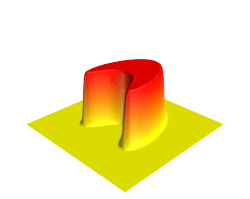
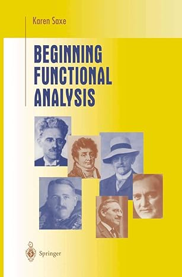

Welcome to the public homepage of **Math F617 Functional Analysis**, Spring 2026, in the [Dept. of Mathematics and Statistics](http://www.uaf.edu/dms/) at the [University of Alaska Fairbanks](http://www.uaf.edu/).

## UNDER CONSTRUCTION!  MANY LINKS BROKEN OR EMPTY

#### Plan

I plan to teach this _functional analysis_ course as though it is in support of the _finite element method_.  Each week I will start with a numerical computation of some kind, and then spend the rest of the week gathering the functional analytic definitions and theory to support it.  Note that _infinite-dimensional normed vector spaces_ are central to functional analysis.  These spaces are useful because they can contain the exact solutions of continuum problems like partial differential equations.  Generally these are spaces of functions on domains in euclidean space, with some given regularity, that is, _Sobolev spaces_.  However, these spaces also contain high-quality approximating finite-dimensional subspaces, such as the piecewise-simple spaces of the finite element method.  This course is not about finite element calculations themselves, and programming will not be an essential skill, but _linear functionals_, _bilinear forms_, _Sobolev spaces_, and _interpolation_ will be important ideas.  We will see how this structure works!  It is experimental.

#### Instructor:  [Ed Bueler](http://bueler.github.io/)

Email me at [elbueler@alaska.edu](mailto:elbueler@alaska.edu).  I hold [office hours](http://bueler.github.io/OffHrs.htm) in Chapman 306C.

### Signing-up

If you plan to be present on campus in Fairbanks during the semester, please sign up for the in-person "901" section (crn 35010), and plan to attend lecture in Chapman 107.  If you are remote, signing up for the web-based "701" section (crn 35018) is just fine!

### Canvas course page

Log in to [canvas.alaska.edu/courses/30068](https://canvas.alaska.edu/courses/30068) for the lecture Zoom link, Homework and Exam solutions, and to see your grades.

### Getting Started (WARNING: UNDER CONSTRUCTION!)

* Get a copy of the textbook, [K. Saxe, _Beginning Functional Analysis_, Undergraduate Texts in Mathematics, Springer 2010](https://link.springer.com/book/10.1007/978-1-4757-3687-8).

* Attend lectures: MWF 10:30-11:30am in Chapman 107, or online.

* Read the [Syllabus (PDF) BROKENLINK](index.html).

* The [Schedule (PDF) BROKENLINK](index.html) is my longer-term plan.  Check it for exam dates and due dates, and for which topics come next!

* The [daily log](daily) has the recent happenings, including handouts and worksheets as PDFs.

* Check out the nearly-weekly [homework Assignments](homework).

* There are three Exams, two Midterm Quizzes and a Final.  All are in class, and the Final will happen at the scheduled time.  See the [Exams](exams) tab for review guides.

 &nbsp; &nbsp;  &nbsp; &nbsp;  &nbsp; &nbsp; 

* What are we studying?  Check out these Wikipedia pages for the topics we plan to touch:

    * [functional analysis](https://en.wikipedia.org/wiki/Functional_analysis)
    * [Hilbert spaces](https://en.wikipedia.org/wiki/Hilbert_space)
    * [Banach spaces](https://en.wikipedia.org/wiki/Banach_space)
    * [Sobolev spaces](https://en.wikipedia.org/wiki/Sobolev_space)
    * [Fourier series](https://en.wikipedia.org/wiki/Fourier_series)
    * [approximation theory](https://en.wikipedia.org/wiki/Approximation_theory)
    * [bounded operators](https://en.wikipedia.org/wiki/Bounded_operator)
    * [partial differential equation](https://en.wikipedia.org/wiki/Partial_differential_equation)
    * [boundary value problems](https://en.wikipedia.org/wiki/Boundary_value_problem)
    * [finite element method](https://en.wikipedia.org/wiki/Finite_element_method)

* Videos which might help with "getting started":
    * [abstract vector spaces (3Blue1Brown)](https://www.youtube.com/watch?v=TgKwz5Ikpc8)
    * [Fourier series (3Blue1Brown)](https://www.youtube.com/watch?v=r6sGWTCMz2k)
    * [partial differential equation (3Blue1Brown)](https://www.youtube.com/watch?v=ly4S0oi3Yz8)
    * [compactness](https://www.youtube.com/watch?v=td7Nz9ATyWY)
    * [Lebesgue integral](https://www.youtube.com/watch?v=LDNDTOVnKJk)

<!--
* [The course advertisement](assets/general/S26/advert.pdf)
/-->

---
_Site design derived from [coordinated Calc I](https://uaf-math.github.io/calc1/), an original [Jekyll](https://jekyllrb.com/) design by [David Maxwell](https://damaxwell.github.io/)._

